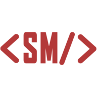

<h1 align="center">Portfólio</h1>

Projetos, postagens e um pouco sobre mim, <a href="https://silvanomarques.vercel.app/">Silvano Marques</a>.

  

## :rocket: Tecnologias

- TypeScript
- ReactJS
- NextJS
- Chakra UI
- Dato CMS
- GraphQL
- TSParticles
- Zustand
- Yup
- React Hook Forms
- React Query

## :sparkles: Imagens

